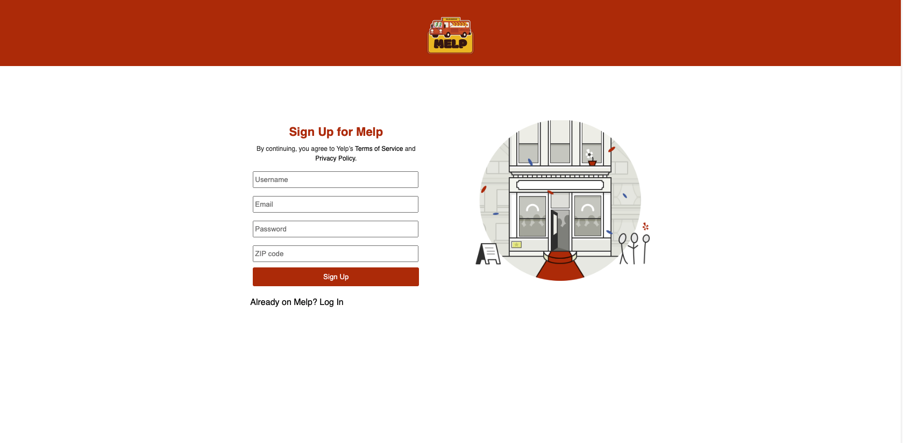
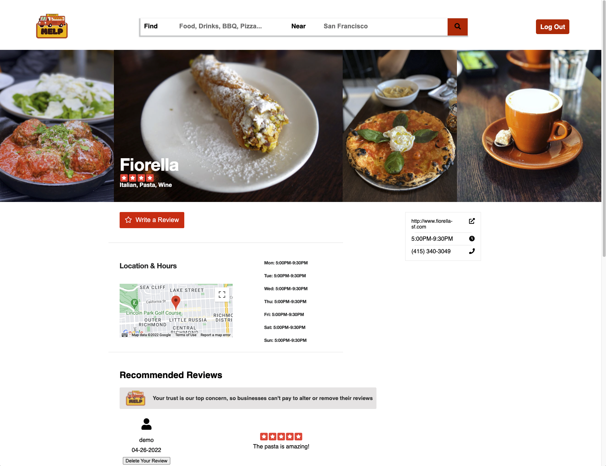
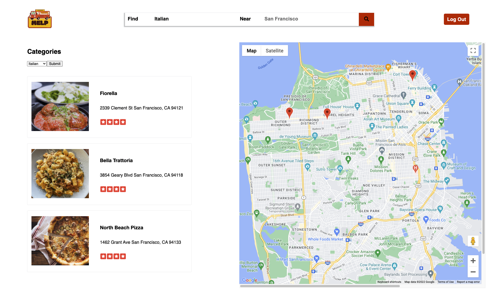
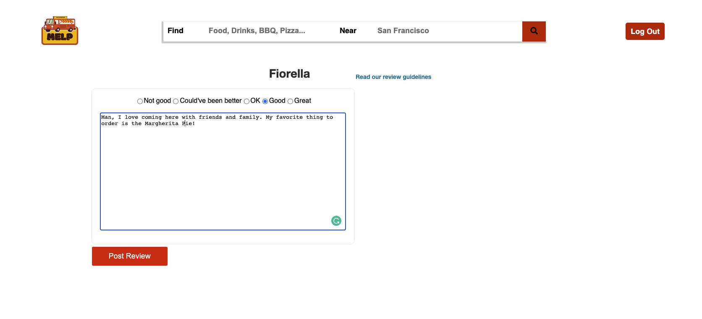

## Introduction

Melp is inspires by Yelp and allows users to look up and access businesses in their local area and view information pertaining to that business. Users are able to create reviews and rate businesses once they create a free account. Design documents can be found [here](https://github.com/mattpettenato/FullStack_Project/wiki)

## [Live Link](https://melp21.herokuapp.com/)

##  Technologies

### Backend
- Ruby
- Ruby on Rails
- Postgresql
### Frontend
- React
- Redux
- HTML
- CSS
- AWS
- Git

## Features
#### User Authentication
Users are able to create an account and sign in or sign in as a demo user. Once the review feature is successfully implemented, users will be required to sign in if they want to create a new review for a business.

#### Business Show Page
The business show page displays information pertaining to a business and includes images, a rating, and a soon user reviews. The google map implmented for every business will show a marker for the exact location of every business in the database.

#### Search
Users are able to search for businesses based off of categories. The categories are created and joined on the backend. 

#### Reviews
Signed in users are able to rate a business and write a review for other users to read through a review form.

